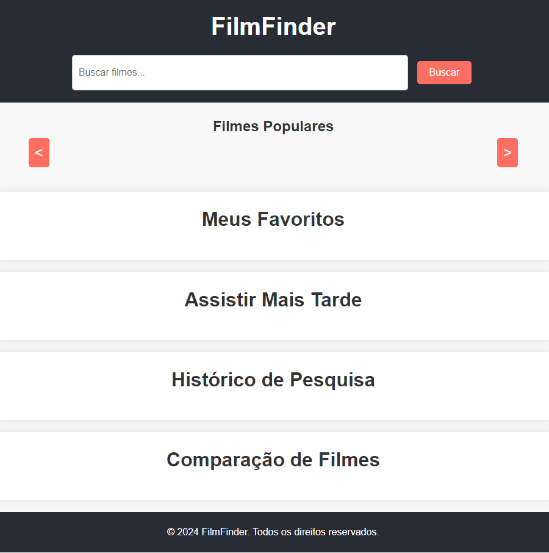

# FilmeFinder

FilmFinder é uma aplicação web projetada para ajudar os usuários a encontrar, avaliar e organizar filmes de forma intuitiva.

## Interface

<div align="center">
  
</div>

## Sumário

- [Tecnologias Utilizadas](#tecnologias-utilizadas)
- [Status](#status)
- [Descrição](#descrição)
- [Funcionalidades](#funcionalidades)
- [Explicação](#explicação)
- [Como Usar](#como-usar)
- [Autor](#autor)

## Tecnologias Utilizadas

<div style="display: flex; flex-direction: row;">
  <div style="margin-right: 20px; display: flex; justify-content: flex-start;">
    
  </div>
  <div style="margin-right: 20px; display: flex; justify-content: flex-start;">
    
  </div>
  <div style="margin-right: 20px; display: flex; justify-content: flex-start;">
    
  </div>
</div>

## Status


<!-- -->

## Descrição

FilmFinder é uma aplicação web que permite aos usuários buscar, explorar e organizar filmes. Através de uma interface intuitiva, os usuários podem encontrar filmes populares, ver detalhes de cada título, e adicionar filmes a listas de favoritos ou para assistir mais tarde. A aplicação também inclui histórico de buscas, um sistema de avaliação por estrelas e opções de compartilhamento para recomendar filmes a outras pessoas. Utiliza a API do The Movie Database (TMDb) para fornecer informações atualizadas sobre filmes.

## Funcionalidades

Funcionalidade de Busca: Permite aos usuários buscar filmes usando uma barra de pesquisa. Os resultados são exibidos em um carrossel de filmes populares, que pode ser navegável.

Detalhes do Filme: Ao selecionar um filme, o usuário vê detalhes extensivos, incluindo título, pôster, e descrição. Também pode adicionar o filme à lista de favoritos ou à lista de "Assistir Mais Tarde".

Favoritos e Assistir Mais Tarde: O usuário pode gerenciar listas de filmes favoritos e aqueles que deseja assistir no futuro. As listas são exibidas em seções dedicadas.

Histórico de Pesquisa: Armazena e exibe o histórico de buscas, permitindo que o usuário reexecute buscas anteriores com um clique.

Comparação de Filmes: Permite comparar filmes lado a lado para facilitar a escolha.

Avaliação e Compartilhamento: Inclui um sistema de avaliação por estrelas e uma função de compartilhamento para recomendar filmes.

## Explicação

```
document.getElementById('search-button').addEventListener('click', function () {
const query = document.getElementById('search-bar').value.trim();
if (query) {
searchMovies(query);
addToSearchHistory(query);
}
});

```

Explicação:
Seleção do Botão de Busca:

```
document.getElementById('search-button')
```

Este trecho seleciona o botão de busca usando o id 'search-button'.

Adiciona um Event Listener:

```
.addEventListener('click', function () {

```

Adiciona um ouvinte de eventos que executa uma função quando o botão de busca é clicado.

Obtém o Valor da Barra de Pesquisa:

```
const query = document.getElementById('search-bar').value.trim();
```

Seleciona a barra de pesquisa ('search-bar'), obtém seu valor e remove espaços em branco extras nas extremidades usando o método trim().

Verifica se a Consulta Não Está Vazia:

javascript
Copiar código
if (query) {
Verifica se a consulta (query) não está vazia para evitar buscas sem parâmetros.

Chama Funções para Buscar Filmes e Atualizar Histórico:

javascript
Copiar código
searchMovies(query);
addToSearchHistory(query);
searchMovies(query): Chama a função searchMovies passando a consulta para buscar filmes que correspondem ao texto inserido.
addToSearchHistory(query): Chama a função addToSearchHistory para adicionar a consulta ao histórico de buscas.

## Como Usar

1.
2.
3.

## Autor

Desenvolvido por Diego Franco
